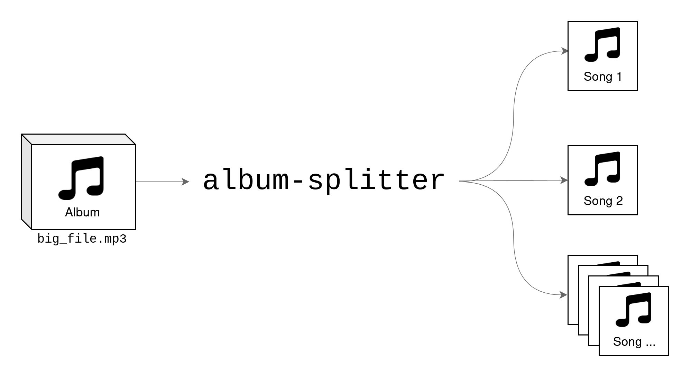

# album-splitter


Use **album-splitter** to automatically split any audio file (youtube videos, albums, podcasts, audiobooks, tapes, vinyls) into separate tracks starting from timestamps. album-splitter will also take care of tagging each part with the correct metadata. If your file is on YouTube, you can download it automatically.

<p align="center">
    
</p>

Common use cases covered:

* music album on YouTube to download and split into tracks
* full audiobook to split into chapters
* music tape/cassette rip to split into tracks
* digitalized vinyl to split into tracks

All you need is:

* The file to split OR an URL of a YouTube video
* Timestamps for each track, for example:
    * `00:06 - When I Was Young`
    * `03:35 Dogs Eating Dogs`

## How to install

First time only:

+ Install `ffmpeg`
    * Linux: `apt install ffmpeg` (or equivalent)
    * Windows: [Official website](https://ffmpeg.org/)
    * MacOS: [Official website](https://ffmpeg.org/) or `brew install ffmpeg`
+ Install `Python 3` (a version newer or equal to `3.7` is required)
    * Linux: `apt install python3` (or equivalent)
    * Windows: [Official webiste](https://www.python.org/)
    * MacOS: You should have it already installed
+ Open your terminal app
+ Create a virtual environment
    * `python3 -m venv venv`
+ Activate the virtual environment
  * Linux/MacOS: `source venv/bin/activate`
  * Windows: `./venv/Scripts/activate`
+ Install album-splitter
    * `python3 -m pip install album-splitter`
+ You are ready to go!

After the first time:

+ Open your terminal app
+ Activate the virtual environment
  * Linux/MacOS: `source venv/bin/activate`
  * Windows: `./venv/Scripts/activate`
+ Optional, update `album-splitter`:
    * `python3 -m pip install --upgrade album-splitter`
+ You are ready to go!

## Quick guide (from a local album)

+ Create a copy of the `tracks.txt.example`, rename it as `tracks.txt`
+ Open `tracks.txt`
+ Add your tracks timestamps info in this format:
    * `<start-time> - <title>`
    * A track on each line
    * See *Examples* section, many other formats supported
+ Run the script
    * Basic usage: `python -m album_splitter --file <path/to/your/album.mp3>`
    * More in the *Examples* section
+ Wait for the splitting process to complete
+ You will find your tracks in the `./splits/` folder

## Quick guide (from a YouTube video)

+ Copy the YouTube URL of the album you want to download and split
+ Find in the YouTube comments the tracklist with start-time and title
+ Create a copy of the `tracks.txt.example`, rename it as `tracks.txt`
+ Open `tracks.txt`
+ Copy the tracklist in the file, adjusting for the supported formats
    * `<start-time> - <title>`
    * A track on each line
+ Run the script
    * Basic usage: `python -m album_splitter -yt <youtube_url>`
    * More in the *Examples* section
+ Wait for the Download and for the conversion
+ Wait for the splitting process to complete
+ You will find your tracks in the `./splits` folder

## Output Format

The format of the output tracks is the same as the format of the input (same extension, same codec, same bitrate, ...), it simply does a copy of the codec. If you want to convert the output tracks to a different format, you can do this using additional tools.

For example to convert from `.wav` to `.mp3` you can use FFmpeg. [Here](https://stackoverflow.com/a/41207442) is how you can do it on Linux/macOS. [This](https://sourceforge.net/projects/ffmpeg-batch/) or [this](https://stackoverflow.com/a/56244203) might help for Windows instead. You can adopt such snippets to do other processing, such as changing the bitrate.

## Examples

### Downloading and splitting an album from YouTube

+ This is the album I want to download and split: `https://www.youtube.com/watch?v=p_uqD4ng9hw`
+ I find the tracklist in the comments and I copy that in `tracks.txt`, eventually adjusting it to a supported format for the tracklist
+
```
00:06 - When I Was Young
...
14:48 - Pretty Little Girl
```

+ I execute `python -m album_splitter -yt "https://www.youtube.com/watch?v=p_uqD4ng9hw"` and wait
+ Once the process is complete I open the `./splits` and I find all my songs:
```
    When I Was Young.mp3
    ...
    Pretty Little Girl.mp3
```
These songs are already mp3-tagged with their track name and track number, but not their author or their album, since we have not specified it.

### Splitting and tagging with Author and Album a local file

+ I somehow got the file `DogsEatingDogsAlbum.mp3` that I want to split
+ I set the tracklist in `tracks.txt` (same tracks as before)
+ I execute `python -m album_splitter --file DogsEatingDogsAlbum.mp3 --album "Dogs Eating Gods" --artist "blink-182" --folder "2012 - Dogs Eating Dogs"`
+ The software will execute, it will split the album, and mp3-tag each track with the author and the album name I passed as a parameter (as well as track number and name). It will also put the files in the folder passed as an argument (instead of putting them in the default `./splits` folder)

## Supported formats for the track list (`tracks.txt`)

These are just some examples, find more in `tracks.txt.example`.

* `[hh:]mm:ss - Title`
* `Title - [hh:]mm:ss`
* `Title [hh:]mm:ss`

To just see which data would be extracted from the tracklist use the option `--dry-run`.

## Available Options

To get the full help and all the available options run `python -m album_splitter --help`

## Need help?

If you need any help just [create an Issue](https://github.com/crisbal/album-splitter/issues) or send me an email at the address you can find on my profile.

## Updating

To update to use the latest version of album-splitter you can use `python3 -m pip install --upgrade album-splitter`

## Want to help?

If you want to improve the code and submit a pull request, please feel free to do so.

## License

GPL v3

## Star History

[](https://star-history.com/#crisbal/album-splitter&Date)

